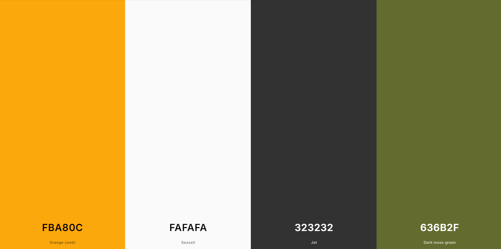
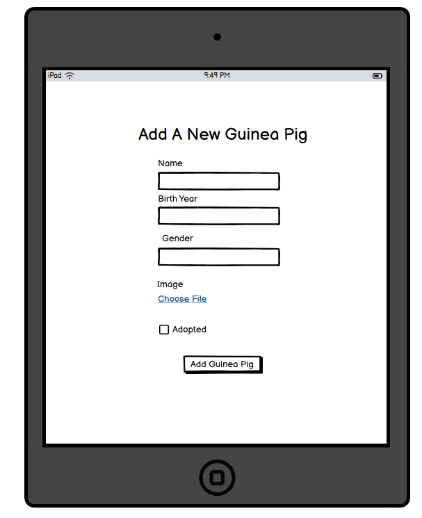

# [LITTLE WHEEKERS RESCUE](https://little-wheekers-rescue-bfdb249eed00.herokuapp.com)

[](https://github.com/marina9222/Little-Wheekers-Rescue/commits/main)
[](https://github.com/marina9222/Little-Wheekers-Rescue/commits/main)
[](https://github.com/marina9222/Little-Wheekers-Rescue)

## Description

Little Wheekers Rescue website is the ultimate platform for guinea pig lovers, dedicated to finding forever homes for these adorable creatures. With a clean, user-friendly interface, users can explore our adoption stories, learn about our adoption policy, and browse available guinea pigs ready for adoption.
The site also features a quick and easy donation process, testimonials, and a secure profile section for adopters. Whether you’re here to adopt, donate, or simply learn more, Little Wheekers Rescue ensures an engaging and hassle-free experience, that brings joy to both adopters and people who would like to help us raise money in order to keep the rescue sustainable.


source: [amiresponsive](https://ui.dev/amiresponsive?url=https://little-wheekers-rescue-bfdb249eed00.herokuapp.com)


## UX


### Colour Scheme

- `#FBA80C` used for website background color.
- `#636B2F` used for primary color.
- `#323232` used for primary text color.
- `#FAFAFA` used primary highlights.

I used [coolors.co](https://coolors.co/e84610-009fe3-4a4a4f-445261-d63649-e6ecf0-000000) to generate my colour palette.



I've used CSS `:root` variables to easily update the global colour scheme by changing only one value, instead of everywhere in the CSS file.

```css
:root {
    
    --primary-text-color:#323232;
    --primary-color: #636B2F;
    --primary-bg-color: #FAFAFA;
}
```

### Typography

- [Lato](https://fonts.google.com/specimen/Lato) was used for the primary headers and titles.

- [Roboto](https://fonts.google.com/specimen/Roboto) was used for all other secondary text.

- [Font Awesome](https://fontawesome.com) icons were used throughout the site, such as sign up and log in forms and in the footer.


## User Stories

### New Site Users

- As a new site user, I would like to be able to register an account quick and easy, so that I can use all the features of the website.
- As a new site user, I would like to be able to see a page with all the guinea pigs available for adoptions, so that I can browse and choose the best match for me.
- As a new site user, I would like to be able to make a donation quick and easy, so that I can help the rescue.
- As a new site user, I would like to read about adoption policy, so that I can feel more comfortable starting the process and feel informed.
- As a new site user, I would like to see a section with a bit more information about the rescue, so that I can feel comfortable donating or adopting.
- As a new site user, I would like to have a donation/adoption history, so I can track it.
- As a new site user, I would like to have a sort button, so I can sort the guinea pigs by age/gender.
- As a new site user, I would like to see if I guinea pig has been adopted , so I can know which one is available.

### Returning Site Users

- As a returning site user, I would like to see adopted or not option in the sorting menu, so that I can check easily which ones are adopted or not instead of scrolling all the way down.
- As a returning site user, I would like to see a picture and more information about the guinea pig I have adopted in my profile history, so that I can be able to remember the iformation about the guinea pig coming.
- As a returning site user, I would like to see more adoption stories, so that I can relate more.
- As a returning site user, I would like to get real life notifications when I'm logged in, so that I can track my adoption or donation or have some information about my chosen guinea pig.


### Site Admin

- As a site administrator, I should be able to add a new guinea pig easily, so that I can update the current available guinea pig database.
- As a site administrator, I should be able to edit a guinea pig, so that I can change any information anytime I want.
- As a site administrator, I should be able to delete a guinea pig.


## Wireframes

### Mobile Wireframes

<details>
<summary> Click here to see the Mobile Wireframes </summary >

Home
  - 

About Us
  - 

Adopt a Guinea pig
  - 

Adoption Policy
  - 

Donate
  - 

Sign Up
  - 

Sign In
  - 

My Profile
  - 

Management
  - 


</details>


### Tablet Wireframes

<details>
<summary> Click here to see the Tablet Wireframes </summary >

Home
  - 

About Us
  - 

Adopt a Guinea pig
  - 

Adoption Policy
  - 

Donate
  - 

Sign Up
  - 

Sign In
  - 

My Profile
  - 

Management
  - 


</details>

### Desktop Wireframes

<details>
<summary> Click here to see the Desktop Wireframes </summary >

Home
  - 

About Us
  - 

Adopt a Guinea pig
  - 

Adoption Policy
  - 

Donate
  - 

Sign Up
  - 

Sign In
  - 

My Profile
  - 

Management
  - 


</details>


## Features


### Existing Features

- **Adopt a Guinea Pig Page**

    - The section of the website allowes users to take a look at the available guinea pigs for adoption so they can choose the perfect match.


- **Adopt a Guinea Pig form**

    - Adoption form that the user needs to fill out in order to apply for an adoption of the chosen guinea pig.


- **Donate section**

    - Users can choose the amount that they would like to donate to the rescue.


- **Donate form**

    - Users can fill the form with their credit/debit card and submit the amount for donation.


- **Adoption Stories**

    - A section of the website showing some of the adoption stories.


- **Total amount raised section**

    - A section of the website showing real time sum of the amount donated to the rescue.


- **Sign In Form**

    - Sign In form for users to be able to log in.


- **Sign Up Form**

    - Sign Up form for users to register an account.


- **Add a Guinea pig / Managemenet**

    - Feature allowing the admin to add a new guinea pig to the database.


- **Edit a Guinea Pig / Managemenet**

    - Feature allowing the admin to add a new guinea pig to the database.


- **Delete a Guinea pig / Managemenet**

    - Feature allowing the admin to add a new guinea pig to the database.


- **My Profile**

    - My Profile section showing the users their history of adoption and donation.


