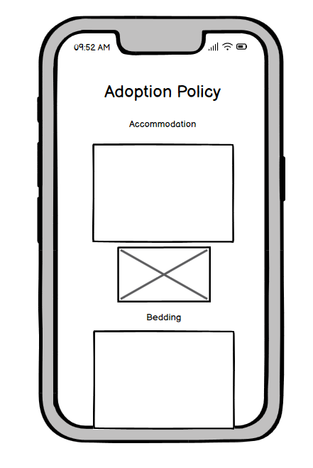
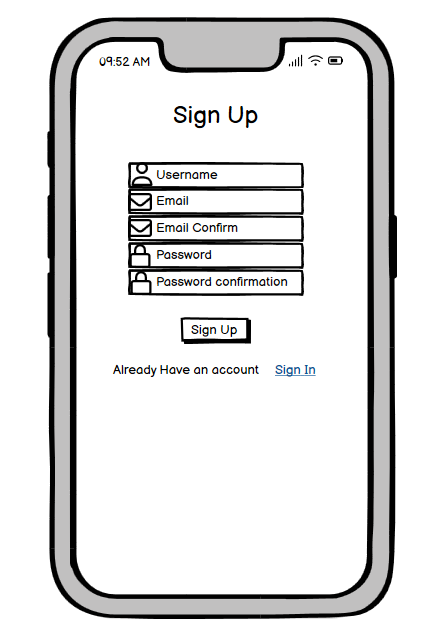
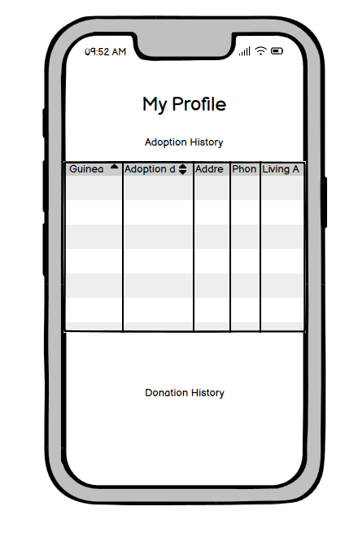

# [LITTLE WHEEKERS RESCUE](https://little-wheekers-rescue-bfdb249eed00.herokuapp.com)

[](https://github.com/marina9222/Little-Wheekers-Rescue/commits/main)
[](https://github.com/marina9222/Little-Wheekers-Rescue/commits/main)
[](https://github.com/marina9222/Little-Wheekers-Rescue)

## Description

Little Wheekers Rescue website is the ultimate platform for guinea pig lovers, dedicated to finding forever homes for these adorable creatures. With a clean, user-friendly interface, users can explore our adoption stories, learn about our adoption policy, and browse available guinea pigs ready for adoption.
The site also features a quick and easy donation process, testimonials, and a secure profile section for adopters. Whether you’re here to adopt, donate, or simply learn more, Little Wheekers Rescue ensures an engaging and hassle-free experience, that brings joy to both adopters and people who would like to help us raise money in order to keep the rescue sustainable.


source: [amiresponsive](https://ui.dev/amiresponsive?url=https://little-wheekers-rescue-bfdb249eed00.herokuapp.com)


## UX


### Colour Scheme

- `#FBA80C` used for website background color.
- `#636B2F` used for primary color.
- `#323232` used for primary text color.
- `#FAFAFA` used primary highlights.

I used [coolors.co](https://coolors.co/e84610-009fe3-4a4a4f-445261-d63649-e6ecf0-000000) to generate my colour palette.


I've used CSS `:root` variables to easily update the global colour scheme by changing only one value, instead of everywhere in the CSS file.

```css
:root {
    
    --primary-text-color:#323232;
    --primary-color: #636B2F;
    --primary-bg-color: #FAFAFA;
}
```

### Typography

- [Lato](https://fonts.google.com/specimen/Lato) was used for the primary headers and titles.

- [Roboto](https://fonts.google.com/specimen/Roboto) was used for all other secondary text.

- [Font Awesome](https://fontawesome.com) icons were used throughout the site, such as sign up and log in forms and in the footer.


## User Stories

### New Site Users

- As a new site user, I would like to be able to register an account quick and easy, so that I can use all the features of the website.
- As a new site user, I would like to be able to see a page with all the guinea pigs available for adoptions, so that I can browse and choose the best match for me.
- As a new site user, I would like to be able to make a donation quick and easy, so that I can help the rescue.
- As a new site user, I would like to read about adoption policy, so that I can feel more comfortable starting the process and feel informed.
- As a new site user, I would like to see a section with a bit more information about the rescue, so that I can feel comfortable donating or adopting.
- As a new site user, I would like to have a donation/adoption history, so I can track it.
- As a new site user, I would like to have a sort button, so I can sort the guinea pigs by age/gender.
- As a new site user, I would like to read adoption stories , so I can see how other users feel after successfull adoption.
- As a new site user, I would like to have a form to fill if I decide to adopt a certain guinea pig.

### Returning Site Users

- As a returning site user, I would like to see adopted or not option in the sorting menu, so that I can check easily which ones are adopted or not instead of scrolling all the way down.
- As a returning site user, I would like to see a picture and more information about the guinea pig I have adopted in my profile history, so that I can be able to remember the iformation about the guinea pig coming.
- As a returning site user, I would like to see more adoption stories, so that I can relate more.
- As a returning site user, I would like to get real life notifications when I'm logged in, so that I can track my adoption or donation or have some information about my chosen guinea pig.


### Site Admin

- As a site administrator, I should be able to add a new guinea pig easily, so that I can update the current available guinea pig database.
- As a site administrator, I should be able to edit a guinea pig, so that I can change any information anytime I want.
- As a site administrator, I should be able to delete a guinea pig.


## Wireframes

### Mobile Wireframes

<details>
<summary> Click here to see the Mobile Wireframes </summary >

Home
  - 

Home Admin
  - 

About Us
  - 

Adopt a Guinea pig
  - 

Adopt a Guinea pig Admin
  - 

Adoption Policy
  - 

Donate
  - 

Sign Up
  - 

Sign In
  - 

My Profile
  - 

Management
  - 


</details>


### Tablet Wireframes

<details>
<summary> Click here to see the Tablet Wireframes </summary >

Home
  - 

Home Admin
  - 

About Us
  - 

Adopt a Guinea pig
  - 

Adopt a Guinea pig Admin
  - 

Adoption Policy
  - 

Donate
  - 

Sign Up
  - 

Sign In
  - 

My Profile
  - 

Management
  - 


</details>

### Desktop Wireframes

<details>
<summary> Click here to see the Desktop Wireframes </summary >

Home
  - 

Home Admin
  - 

About Us
  - 

Adopt a Guinea pig
  - 

Adopt a Guinea pig Admin
  - 

Adoption Policy
  - 

Donate
  - 

Sign Up
  - 

Sign In
  - 

My Profile
  - 

Management
  - 


</details>


## Features


### Existing Features

- **Adopt a Guinea Pig Page**

    - The section of the website allowes users to take a look at the available guinea pigs for adoption so they can choose the perfect match.


- **Adopt a Guinea Pig form**

    - Adoption form that the user needs to fill out in order to apply for an adoption of the chosen guinea pig.


- **Donate section**

    - Users can choose the amount that they would like to donate to the rescue.


- **Donate form**

    - Users can fill the form with their credit/debit card and submit the amount for donation.


- **Adoption Stories**

    - A section of the website showing some of the adoption stories.


- **Total amount raised section**

    - A section of the website showing real time sum of the amount donated to the rescue.


- **Sign In Form**

    - Sign In form for users to be able to log in.


- **Sign Up Form**

    - Sign Up form for users to register an account.


- **Add a Guinea pig / Managemenet**

    - Feature allowing the admin to add a new guinea pig to the database.


- **Edit a Guinea Pig / Managemenet**

    - Feature allowing the admin to add a new guinea pig to the database.


- **Delete a Guinea pig / Managemenet**

    - Feature allowing the admin to add a new guinea pig to the database.


- **My Profile**

    - My Profile section showing the users their history of adoption and donation.


- **Sort Button**

    - Sort button allowing users to sort the guinea pigs available for adoption and already adopted ones by age and gender.


### Future Features

- Adopted/Not choice to the sort button on avaialble guinea pigs page.
    - Adding additional adopted/not choice to the sort button.
- Add an image/information of the adopted guinea pig.
    - Addition to the my profile picture so the users can see the image again and the information of the guinea pig they applied for.
- More adoption stories
    - Add more stories from users adopted guinea pigs.
- Notifications
    - Real life notifications when user is logged in about donation/adoption or just an update.


## Tools & Technologies Used

- [](https://tim.2bn.dev/markdown-builder) used to generate README and TESTING templates.
- [](https://git-scm.com) used for version control. (`git add`, `git commit`, `git push`)
- [](https://github.com) used for secure online code storage.
- [](https://gitpod.io) used as a cloud-based IDE for development.
- [](https://en.wikipedia.org/wiki/HTML) used for the main site content.
- [](https://en.wikipedia.org/wiki/CSS) used for the main site design and layout.
- [](https://www.javascript.com) used for user interaction on the site.
- [](https://www.python.org) used as the back-end programming language.
- [](https://pages.github.com) used for hosting the deployed front-end site.
- [](https://www.heroku.com) used for hosting the deployed back-end site.
- [](https://getbootstrap.com) used as the front-end CSS framework for modern responsiveness and pre-built components.
- [](https://www.djangoproject.com) used as the Python framework for the site.
- [](https://dbs.ci-dbs.net) used as the Postgres database from Code Institute.
- [](https://cloudinary.com) used for online static file storage.
- [](https://whitenoise.readthedocs.io) used for serving static files with Heroku.
- [](https://stripe.com) used for online secure payments of ecommerce products/services.
- [](https://mail.google.com) used for sending emails in my application.
- [](https://balsamiq.com/wireframes) used for creating wireframes.
- [](https://fontawesome.com) used for the icons.
- [](https://chat.openai.com) used to help debug, troubleshoot, and explain things.


## Database Design

I have used `pygraphviz` and `django-extensions` to auto-generate an ERD.

The steps taken were as follows:
- In the terminal: `sudo apt update`
- then: `sudo apt-get install python3-dev graphviz libgraphviz-dev pkg-config`
- then type `Y` to proceed
- then: `pip3 install django-extensions pygraphviz`
- in my `settings.py` file, I added the following to my `INSTALLED_APPS`:
```python
INSTALLED_APPS = [
    ...
    'django_extensions',
    ...
]
```
- back in the terminal: `python3 manage.py graph_models -a -o erd.png`
- dragged the new `erd.png` file into my `documentation/` folder
- removed `'django_extensions',` from my `INSTALLED_APPS`
- finally, in the terminal: `pip3 uninstall django-extensions pygraphviz -y`


source: [medium.com](https://medium.com/@yathomasi1/1-using-django-extensions-to-visualize-the-database-diagram-in-django-application-c5fa7e710e16)


## Testing

> [!NOTE]  
> For all testing, please refer to the [TESTING.md](TESTING.md) file.


## Deployment

The live deployed application can be found deployed on [Heroku](https://little-wheekers-rescue-bfdb249eed00.herokuapp.com).


### PostgreSQL Database

This project uses a [Code Institute PostgreSQL Database](https://dbs.ci-dbs.net).

To obtain my own Postgres Database from Code Institute, I followed these steps:

- Signed-in to the CI LMS using my email address.
- An email was sent to me with my new Postgres Database.

> [!CAUTION]  
> - PostgreSQL databases by Code Institute are only available to CI Students.
> - You must acquire your own PostgreSQL database through some other method
> if you plan to clone/fork this repository.
> - Code Institute students are allowed a maximum of 8 databases.
> - Databases are subject to deletion after 18 months.


### Stripe API

This project uses [Stripe](https://stripe.com) to handle the ecommerce payments.

Once you've created a Stripe account and logged-in, follow these series of steps to get your project connected.

- From your Stripe dashboard, click to expand the "Get your test API keys".
- You'll have two keys here:
	- `STRIPE_PUBLIC_KEY` = Publishable Key (starts with **pk**)
	- `STRIPE_SECRET_KEY` = Secret Key (starts with **sk**)

As a backup, in case users prematurely close the purchase-order page during payment, we can include Stripe Webhooks.

- From your Stripe dashboard, click **Developers**, and select **Webhooks**.
- From there, click **Add Endpoint**.
	- `https://little-wheekers-rescue-bfdb249eed00.herokuapp.com/checkout/wh/`
- Click **receive all events**.
- Click **Add Endpoint** to complete the process.
- You'll have a new key here:
	- `STRIPE_WH_SECRET` = Signing Secret (Wehbook) Key (starts with **wh**)

### Gmail API

This project uses [Gmail](https://mail.google.com) to handle sending emails to users for account verification and purchase order confirmations.

Once you've created a Gmail (Google) account and logged-in, follow these series of steps to get your project connected.

- Click on the **Account Settings** (cog icon) in the top-right corner of Gmail.
- Click on the **Accounts and Import** tab.
- Within the section called "Change account settings", click on the link for **Other Google Account settings**.
- From this new page, select **Security** on the left.
- Select **2-Step Verification** to turn it on. (verify your password and account)
- Once verified, select **Turn On** for 2FA.
- Navigate back to the **Security** page, and you'll see a new option called **App passwords**.
- This might prompt you once again to confirm your password and account.
- Select **Mail** for the app type.
- Select **Other (Custom name)** for the device type.
	- Any custom name, such as "Django" or Little-Wheekers-Rescue
- You'll be provided with a 16-character password (API key).
	- Save this somewhere locally, as you cannot access this key again later!
	- `EMAIL_HOST_PASS` = user's 16-character API key
	- `EMAIL_HOST_USER` = user's own personal Gmail email address

### Heroku Deployment

This project uses [Heroku](https://www.heroku.com), a platform as a service (PaaS) that enables developers to build, run, and operate applications entirely in the cloud.

Deployment steps are as follows, after account setup:

- Select **New** in the top-right corner of your Heroku Dashboard, and select **Create new app** from the dropdown menu.
- Your app name must be unique, and then choose a region closest to you (EU or USA), and finally, select **Create App**.
- From the new app **Settings**, click **Reveal Config Vars**, and set your environment variables.

> [!IMPORTANT]  
> This is a sample only; you would replace the values with your own if cloning/forking my repository.

| Key | Value |
| --- | --- |
| `DATABASE_URL` | user's own value |
| `DISABLE_COLLECTSTATIC` | 1 (*this is temporary, and can be removed for the final deployment*) |
| `EMAIL_HOST_PASS` | user's own value |
| `EMAIL_HOST_USER` | user's own value |
| `SECRET_KEY` | user's own value |
| `STRIPE_PUBLIC_KEY` | user's own value |
| `STRIPE_SECRET_KEY` | user's own value |
| `STRIPE_WH_SECRET` | user's own value |
| `CLOUDINARY_CLOUD_NAME` | user's own value |
| `CLOUDINARY_API_KEY` | user's own value |
| `CLOUDINARY_API_SECRET` | user's own value |


Heroku needs three additional files in order to deploy properly.

- requirements.txt
- Procfile
- runtime.txt

You can install this project's **requirements** (where applicable) using:

- `pip3 install -r requirements.txt`

If you have your own packages that have been installed, then the requirements file needs updated using:

- `pip3 freeze --local > requirements.txt`

The **Procfile** can be created with the following command:

- `echo web: gunicorn app_name.wsgi > Procfile`
- *replace **app_name** with the name of your primary Django app name; the folder where settings.py is located*

The **runtime.txt** file needs to know which Python version you're using:
1. type: `python3 --version` in the terminal.
2. in the **runtime.txt** file, add your Python version:
	- `python-3.9.19`

For Heroku deployment, follow these steps to connect your own GitHub repository to the newly created app:

Either:

- Select **Automatic Deployment** from the Heroku app.

Or:

- In the Terminal/CLI, connect to Heroku using this command: `heroku login -i`
- Set the remote for Heroku: `heroku git:remote -a app_name` (replace *app_name* with your app name)
- After performing the standard Git `add`, `commit`, and `push` to GitHub, you can now type:
	- `git push heroku main`

The project should now be connected and deployed to Heroku!

### Local Deployment

This project can be cloned or forked in order to make a local copy on your own system.

For either method, you will need to install any applicable packages found within the *requirements.txt* file.

- `pip3 install -r requirements.txt`.

You will need to create a new file called `env.py` at the root-level,
and include the same environment variables listed above from the Heroku deployment steps.

> [!IMPORTANT]  
> This is a sample only; you would replace the values with your own if cloning/forking my repository.

Sample `env.py` file:

```python
import os

os.environ.setdefault("DATABASE_URL", "user's own value")
os.environ.setdefault("EMAIL_HOST_PASS", "user's own value")
os.environ.setdefault("EMAIL_HOST_USER", "user's own value")
os.environ.setdefault("STRIPE_PUBLIC_KEY", "user's own value")
os.environ.setdefault("STRIPE_SECRET_KEY", "user's own value")
os.environ.setdefault("CLOUDINARY_CLOUD_NAME", "user's own value")
os.environ.setdefault("CLOUDINARY_API_KEY", "user's own value")
os.environ.setdefault("CLOUDINARY_API_SECRET", "user's own value")

# local environment only (do not include these in production/deployment!)
os.environ.setdefault("DEBUG", "True")
```

Once the project is cloned or forked, in order to run it locally, you'll need to follow these steps:

- Start the Django app: `python3 manage.py runserver`
- Stop the app once it's loaded: `CTRL+C` or `⌘+C` (Mac)
- Make any necessary migrations: `python3 manage.py makemigrations`
- Migrate the data to the database: `python3 manage.py migrate`
- Create a superuser: `python3 manage.py createsuperuser`
- Load fixtures (if applicable): `python3 manage.py loaddata file-name.json` (repeat for each file)
- Everything should be ready now, so run the Django app again: `python3 manage.py runserver`

If you'd like to backup your database models, use the following command for each model you'd like to create a fixture for:

- `python3 manage.py dumpdata your-model > your-model.json`
- *repeat this action for each model you wish to backup*

#### Cloning

You can clone the repository by following these steps:

1. Go to the [GitHub repository](https://github.com/marina9222/Little-Wheekers-Rescue) 
2. Locate the Code button above the list of files and click it 
3. Select if you prefer to clone using HTTPS, SSH, or GitHub CLI and click the copy button to copy the URL to your clipboard
4. Open Git Bash or Terminal
5. Change the current working directory to the one where you want the cloned directory
6. In your IDE Terminal, type the following command to clone my repository:
	- `git clone https://github.com/marina9222/Little-Wheekers-Rescue.git`
7. Press Enter to create your local clone.

Alternatively, if using Gitpod, you can click below to create your own workspace using this repository.

[](https://gitpod.io/#https://github.com/marina9222/Little-Wheekers-Rescue)

Please note that in order to directly open the project in Gitpod, you need to have the browser extension installed.
A tutorial on how to do that can be found [here](https://www.gitpod.io/docs/configure/user-settings/browser-extension).

#### Forking

By forking the GitHub Repository, we make a copy of the original repository on our GitHub account to view and/or make changes without affecting the original owner's repository.
You can fork this repository by using the following steps:

1. Log in to GitHub and locate the [GitHub Repository](https://github.com/marina9222/Little-Wheekers-Rescue)
2. At the top of the Repository (not top of page) just above the "Settings" Button on the menu, locate the "Fork" Button.
3. Once clicked, you should now have a copy of the original repository in your own GitHub account!

## Credits

### Content

| Source | Location | Notes |
| --- | --- | --- |
| [Markdown Builder](https://tim.2bn.dev/markdown-builder) | README and TESTING | tool to help generate the Markdown files |
| [WhiteNoise](http://whitenoise.evans.io) | entire site | hosting static files on Heroku temporarily |
| [Bootstrap Docs](https://getbootstrap.com/docs/5.0/getting-started/introduction/) | entire site | making a responsive website |


### Media

| Source | Location | Type | Notes |
| --- | --- | --- | --- |
| [Freepik](https://www.freepik.com/free-photo/beautiful-guinea-pig-pet-portrait_19866370.htm#fromView=keyword&page=2&position=41&uuid=60c0bcf0-7c12-4987-ae49-e4179e33732f) | home page | image | background |
| [Canva](https://www.canva.com/) | entire website | logo | website logo |
| [Gerties](https://www.gerties.org.uk/) | adoption policy | image and text | entire adoption policy page |
| [Kaggle](https://www.kaggle.com/datasets/lrntszab/guinea-pig-detection?resource=download) | adopt a guinea pig | images | guinea pig database images |
| [Google Images](https://google.com/images) | adoption stories | images | adopters images |


### Acknowledgements

- I would like to thank my Code Institute mentor, [Tim Nelson](https://github.com/TravelTimN) for his support throughout the development of this project.
- I would like to thank the [Code Institute](https://codeinstitute.net) tutor team for their assistance with troubleshooting and debugging some project issues.
- I would like to thank the [Code Institute Slack community](https://code-institute-room.slack.com) for the moral support; it kept me going during periods of self doubt and impostor syndrome.
- I would like to thank my partner, for believing in me, and allowing me to make this transition into software development.
- I would like to thank my guinea pigs Cookie and Mellow, for giving me inspiration for the websites.
