# Testing

> [!NOTE]  
> Return back to the [README.md](README.md) file.

## Code Validation

### HTML

I have used the recommended [HTML W3C Validator](https://validator.w3.org) to validate all of my HTML files.

| Directory | File | Screenshot | Notes |
| --- | --- | --- | --- |
| adoptions | adopt_guinea_pig.html |  | pass |
| adoptions | adoption_success.html | 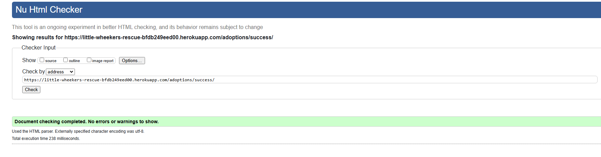 | pass |
| adoptions | available_guinea_pigs.html | 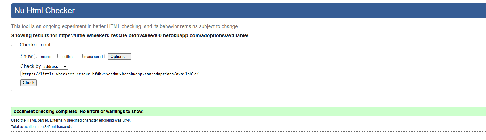 | pass |
| adoptions | my_profile.html | 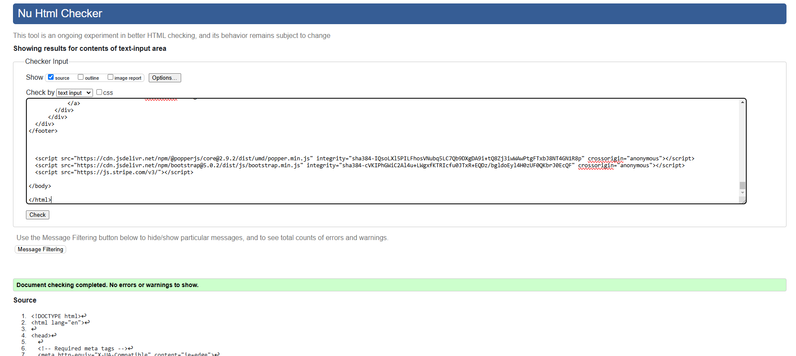 | pass |
| home | about_us.html | 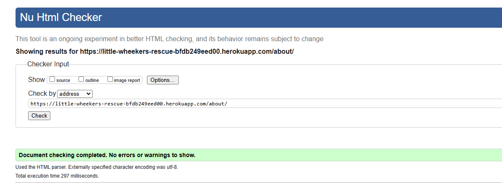 | pass |
| home | adoption_policy.html | 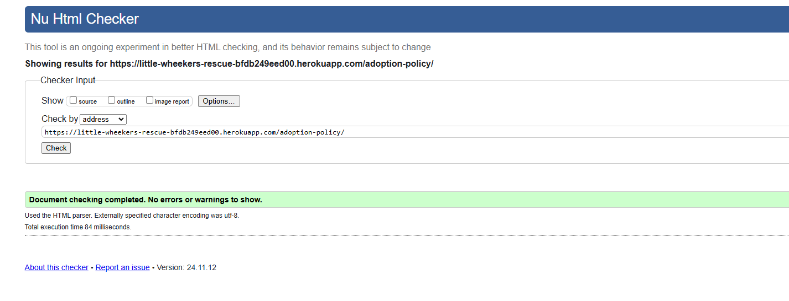 | pass |
| home | delete_guinea_pig.html | 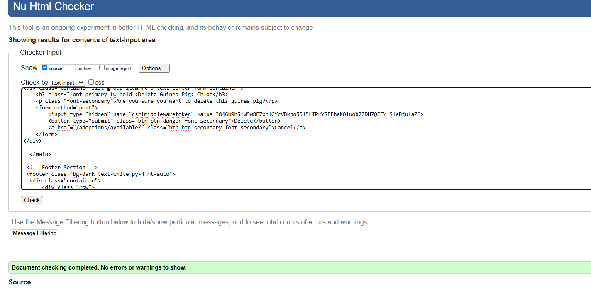 | pass |
| home | donate.html | 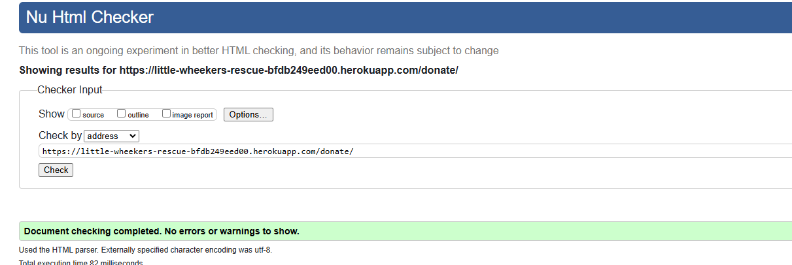 | pass |
| home | donation_cancel.html | 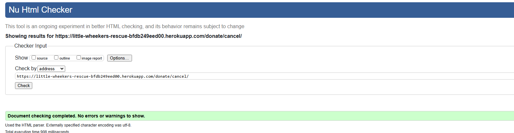 | pass |
| home | donation_success.html |  | |
| home | edit_guinea_pig.html | 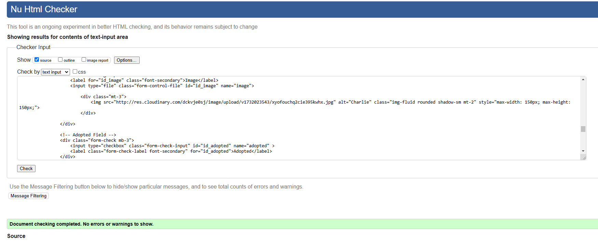 | pass |
| home | index.html | 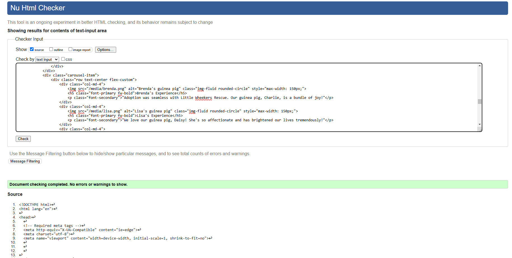 | pass |
| home | management.html | 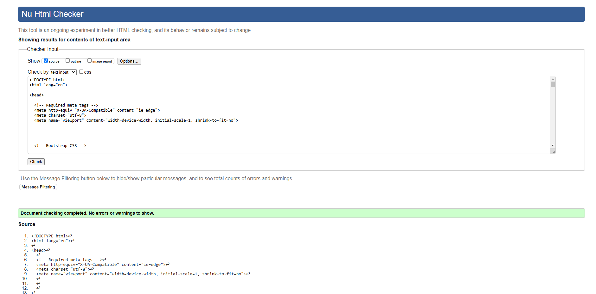 | pass |
