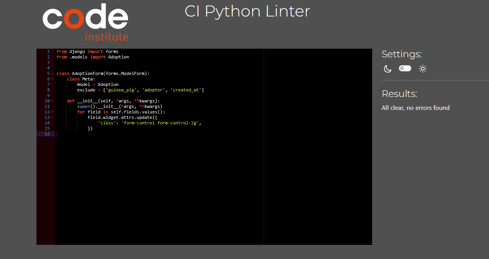
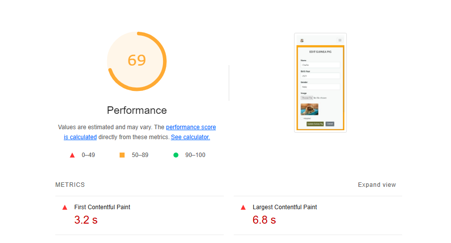
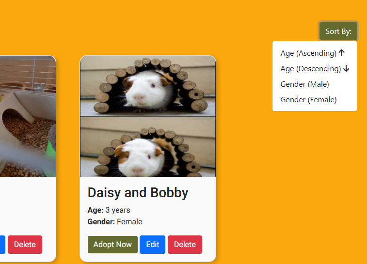
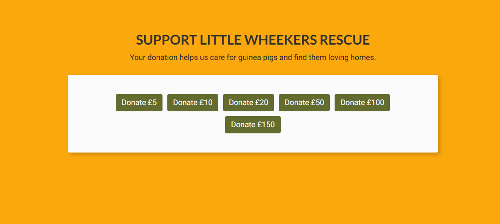
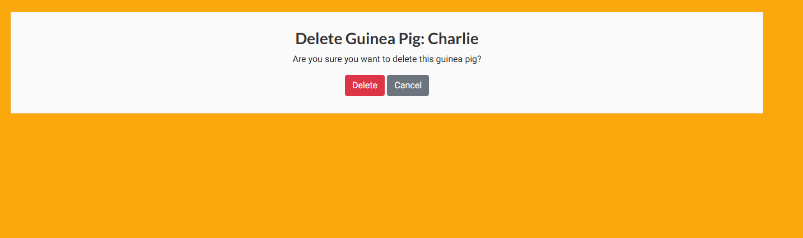
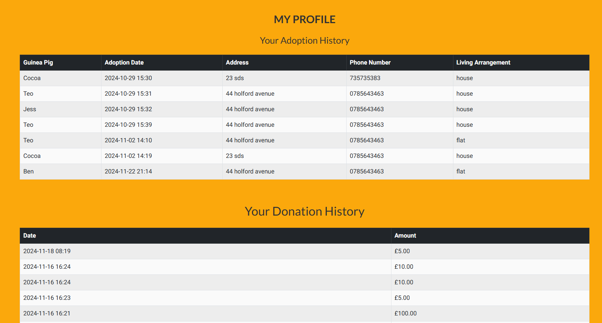

# Testing

> [!NOTE]  
> Return back to the [README.md](README.md) file.

## Code Validation

### HTML

I have used the recommended [HTML W3C Validator](https://validator.w3.org) to validate all of my HTML files.

| Directory | File | Screenshot | Notes |
| --- | --- | --- | --- |
| adoptions | adopt_guinea_pig.html |  | pass |
| adoptions | adoption_success.html |  | pass |
| adoptions | available_guinea_pigs.html |  | pass |
| adoptions | my_profile.html |  | pass |
| home | about_us.html |  | pass |
| home | adoption_policy.html |  | pass |
| home | delete_guinea_pig.html |  | pass |
| home | donate.html |  | pass |
| home | donation_cancel.html |  | pass |
| home | donation_success.html |  | |
| home | edit_guinea_pig.html |  | pass |
| home | index.html |  | pass |
| home | management.html |  | pass |

### CSS

I have used the recommended [CSS Jigsaw Validator](https://jigsaw.w3.org/css-validator) to validate all of my CSS files.

| Directory | File | Screenshot | Notes |
| --- | --- | --- | --- |
| static | base.css |  | pass |

### Python

I have used the recommended [PEP8 CI Python Linter](https://pep8ci.herokuapp.com) to validate all of my Python files.

| Directory | File | CI URL | Screenshot | Notes |
| --- | --- | --- | --- | --- |
| adoptions | admin.py | [PEP8 CI](https://pep8ci.herokuapp.com/https://raw.githubusercontent.com/marina9222/Little-Wheekers-Rescue/main/adoptions/admin.py) |  | pass |
| adoptions | forms.py | [PEP8 CI](https://pep8ci.herokuapp.com/https://raw.githubusercontent.com/marina9222/Little-Wheekers-Rescue/main/adoptions/forms.py) |  | pass |
| adoptions | models.py | [PEP8 CI](https://pep8ci.herokuapp.com/https://raw.githubusercontent.com/marina9222/Little-Wheekers-Rescue/main/adoptions/models.py) |  | pass |
| adoptions | urls.py | [PEP8 CI](https://pep8ci.herokuapp.com/https://raw.githubusercontent.com/marina9222/Little-Wheekers-Rescue/main/adoptions/urls.py) |  | pass |
| adoptions | views.py | [PEP8 CI](https://pep8ci.herokuapp.com/https://raw.githubusercontent.com/marina9222/Little-Wheekers-Rescue/main/adoptions/views.py) |  | pass |
| home | forms.py | [PEP8 CI](https://pep8ci.herokuapp.com/https://raw.githubusercontent.com/marina9222/Little-Wheekers-Rescue/main/home/forms.py) |  | pass |
| home | models.py | [PEP8 CI](https://pep8ci.herokuapp.com/https://raw.githubusercontent.com/marina9222/Little-Wheekers-Rescue/main/home/models.py) |  | pass |
| home | urls.py | [PEP8 CI](https://pep8ci.herokuapp.com/https://raw.githubusercontent.com/marina9222/Little-Wheekers-Rescue/main/home/urls.py) |  | pass |
| home | views.py | [PEP8 CI](https://pep8ci.herokuapp.com/https://raw.githubusercontent.com/marina9222/Little-Wheekers-Rescue/main/home/views.py) |  | pass |
| little_wheekers_rescue | settings.py | [PEP8 CI](https://pep8ci.herokuapp.com/https://raw.githubusercontent.com/marina9222/Little-Wheekers-Rescue/main/little_wheekers_rescue/settings.py) |  | pass |
| little_wheekers_rescue | urls.py | [PEP8 CI](https://pep8ci.herokuapp.com/https://raw.githubusercontent.com/marina9222/Little-Wheekers-Rescue/main/little_wheekers_rescue/urls.py) |  | pass |
|  | manage.py | [PEP8 CI](https://pep8ci.herokuapp.com/https://raw.githubusercontent.com/marina9222/Little-Wheekers-Rescue/main/manage.py) |  | pass |

## Browser Compatibility

I've tested my deployed project on multiple browsers to check for compatibility issues.

| Browser | Home | About Us | Adopt a Guinea Pig | Adoption Policy | Donate | Sign In | Sign Up | Management | My Profile | Edit Guinea Pig | Delete Guinea Pig | Notes |
| --- | --- | --- | --- | --- | --- | --- | --- | --- | --- | --- | --- | --- |
| Chrome |  |  |  |  | |  |  |  |  |  |  | Works as expected |
| Firefox |  |  |  |  |  |   |   |  |  |  |  | Works as expected |
| Opera |  |  |  |  |  |  |  |  |  |  |  | Works as expected |

## Responsiveness

I've tested my deployed project on multiple devices to check for responsiveness issues.

| Device | Home | About Us | Adopt a Guinea Pig | Adoption Policy | Donate | Sign In | Sign Up | Management | My Profile | Edit Guinea Pig | Delete Guinea Pig | Notes |
| --- | --- | --- | --- | --- | --- | --- | --- | --- | --- | --- | --- | --- |
| Mobile (DevTools) |  |  |  |  |  |  |  |  |  |  |  | Works as expected |
| Tablet (DevTools) |  |  |  |  |  |  |  |  |  |  |  | Works as expected |
| Desktop |  |  |  |  |  |  |  |  |  |  |  | Works as expected |

## Lighthouse Audit

I've tested my deployed project using the Lighthouse Audit tool to check for any major issues.

| Page | Mobile | Desktop | Notes |
| --- | --- | --- | --- |
| Home |  |  | Some minor warnings |
| About Us |  |  | Some minor warnings |
| Adopt a Guinea Pig |  |  | Slow response time due to large images |
| Adoption Policy |  |  | Some minor warnings |
| Donate |  |  | Some minor warnings |
| Sign In |  |  | Some minor warnings |
| Sign Up |  |  | Some minor warnings |
| Management |  |  | Some minor warnings |
| My Profile |  |  | Some minor warnings |
| Edit Guinea Pig |  |  | Some minor warnings |
| Delete Guinea Pig |  |  | Some minor warnings |

## Defensive Programming

| Page | Expectation | Test | Result | Fix | Screenshot |
| --- | --- | --- | --- | --- | --- |
| Adopt a Guinea Pig | | | | | |
| | Feature is expected to show all the guinea pigs available for adoption and once already adopted when the user visits the page | Tested the feature by opening the page | The feature behaved as expected, and it show all the guinea pigs | Test concluded and passed |  |
| | Feature is expected to submit an adoption form when the user is authenticated and fills it | Tested the feature by fillign the form after a logged in | The feature behaved as expected, and it successfully submitted the form when everything is filled | Test concluded and passed |  |
| | Feature is expected to do sort the guinea pigs by age or gender when the user clicks on the sort button | Tested the feature by doing it | The feature behaved as expected, and it did sort the guinea pigs by age and gender | Test concluded and passed |  |
| Donate | | | | | |
| | Feature is expected to show different amounts for donation and open the stripe form when the user clicks on the chosen amount | Tested the feature by doing it | The feature behaved as expected, and it open the stripe checkout successfully  | Test concluded and passed |  |
| | Feature is expected to donate the chosen amount when the users fill their credit card information | Tested the feature by filling the form |The feature behaved as expected, and it  successfully donated the amount | Test concluded and passed |  |
| Home | | | | | |
| | Feature is expected to show all the adoption stories in the carousel when the user clicks on the arrow | Tested the feature by doing it | The feature behaved as expected, and it did show all the stories | Test concluded and passed |  |
| | Feature is expected to show the live donations raised and update each time someone makes a donation | Tested the feature by donating | The feature behaved as expected, and it did update | Test concluded and passed |  |
| | Feature is expected to sign a user in when the user fills the form and already holds an account | Tested the feature by doing it. | The feature behaved as expected, and it logged me in | Test concluded and passed |  |
| | Feature is expected to register an user when the user filles all the inputs in the form | Tested the feature by registering an account with filling all the inputs | The feature behaved as expected, and it registered an account which will be active after I confirm my email | Test concluded and passed |   |
| Management | | | | | |
| | Feature is expected to do add a new guinea pig when the site admin fills the form | Tested the feature by doing it. | The feature behaved as expected, and it add the guinea pig | Test concluded and passed |  |
| | Feature is expected to edit a guinea pig information when the site admin clicks on the edit button on the chosen guinea pig | Tested the feature by clicking on the edit button and fill the form |  The feature behaved as expected, and it updated the guinea pig information | Test concluded and passed  |  |
| | Feature is expected to delete a guinea pig when the site admin clicks on the delete button on the chosen guinea pig | Tested the feature by clicking on the delete button and confirm that I want to delete the guinea pig | The feature behaved as expected, and it delete the guinea pig | Test concluded and passed |  |
| My Profile | | | | | |
| | Feature is expected to show the donation and adoption history of the user if any | Tested the feature by donating and adopting | The feature behaved as expected, and it showed my history of donation and adoption | Test concluded and passed |  |

## User Story Testing

| User Story | Screenshot |
| --- | --- |
| As a new site user, I would like to be able to register an account quick and easy, so that I can use all the features of the website. |  |
|  As a new site user, I would like to be able to see a page with all the guinea pigs available for adoptions, so that I can browse and choose the best match for me. |  |
| As a new site user, I would like to be able to make a donation quick and easy, so that I can help the rescue. |  |
| As a new site user, I would like to be able to make a donation quick and easy, so that I can help the rescue.|  |
| As a new site user, I would like to see a section with a bit more information about the rescue, so that I can feel comfortable donating or adopting.|  |
| As a new site user, I would like to have a donation/adoption history, so I can track it. |  |
| As a new site user, I would like to have a sort button, so I can sort the guinea pigs by age/gender. |  |
| As a new site user, I would like to have a form to fill if I decide to adopt a certain guinea pig.  |  |
| As a new site user, I would like to read about adoption policy, so that I can feel more comfortable starting the process and feel informed. |  |
| As a new site user, I would like to read adoption stories , so I can see how other users feel after successfull adoption. |  |
| As a site administrator, I should be able to add a new guinea pig easily, so that I can update the current available guinea pig database. |  |
| As a site administrator, I should be able to edit a guinea pig, so that I can change any information anytime I want. |  |
| As a site administrator, I should be able to delete a guinea pig. |  |
| As a returning site user, I would like to see adopted or not option in the sorting menu, so that I can check easily which ones are adopted or not instead of scrolling all the way down. | future features |
| As a returning site user, I would like to see a picture and more information about the guinea pig I have adopted in my profile history, so that I can be able to remember the iformation about the guinea pig coming. | future features |
| As a returning site user, I would like to see more adoption stories, so that I can relate more. | future features |
| As a returning site user, I would like to get real life notifications when I'm logged in, so that I can track my adoption or donation or have some information about my chosen guinea pig. | future features |

## Bugs

- Django `ValueError` at /adotpions/adopt

    

    - To fix this, I added char fields to the adoption model.

- Django `ValueError api key` at /guineapig/add

    

    - To fix this, I updated the cloudinary version.

- Django `DataError` at /adopt

    

    - To fix this, I added positive integer field validators to the Adoption model living arrangements.

## Unfixed Bugs

> [!NOTE]  
> There are no remaining bugs that I am aware of.
