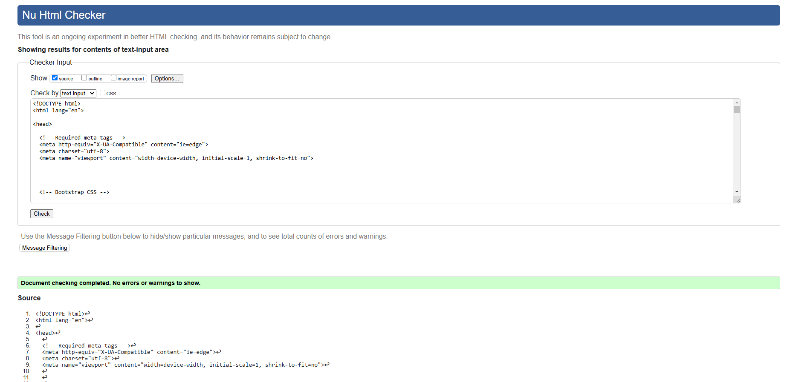

# Testing

> [!NOTE]  
> Return back to the [README.md](README.md) file.

## Code Validation

### HTML

I have used the recommended [HTML W3C Validator](https://validator.w3.org) to validate all of my HTML files.

| Directory | File | Screenshot | Notes |
| --- | --- | --- | --- |
| adoptions | adopt_guinea_pig.html |  | pass |
| adoptions | adoption_success.html |  | pass |
| adoptions | available_guinea_pigs.html |  | pass |
| adoptions | my_profile.html |  | pass |
| home | about_us.html |  | pass |
| home | adoption_policy.html |  | pass |
| home | delete_guinea_pig.html |  | pass |
| home | donate.html |  | pass |
| home | donation_cancel.html |  | pass |
| home | donation_success.html |  | |
| home | edit_guinea_pig.html |  | pass |
| home | index.html |  | pass |
| home | management.html |  | pass |

### CSS

I have used the recommended [CSS Jigsaw Validator](https://jigsaw.w3.org/css-validator) to validate all of my CSS files.

| Directory | File | Screenshot | Notes |
| --- | --- | --- | --- |
| static | base.css |  | pass |

### Python

I have used the recommended [PEP8 CI Python Linter](https://pep8ci.herokuapp.com) to validate all of my Python files.

| Directory | File | CI URL | Screenshot | Notes |
| --- | --- | --- | --- | --- |
| adoptions | admin.py | [PEP8 CI](https://pep8ci.herokuapp.com/https://raw.githubusercontent.com/marina9222/Little-Wheekers-Rescue/main/adoptions/admin.py) |  | pass |
| adoptions | forms.py | [PEP8 CI](https://pep8ci.herokuapp.com/https://raw.githubusercontent.com/marina9222/Little-Wheekers-Rescue/main/adoptions/forms.py) |  | pass |
| adoptions | models.py | [PEP8 CI](https://pep8ci.herokuapp.com/https://raw.githubusercontent.com/marina9222/Little-Wheekers-Rescue/main/adoptions/models.py) |  | pass |
| adoptions | urls.py | [PEP8 CI](https://pep8ci.herokuapp.com/https://raw.githubusercontent.com/marina9222/Little-Wheekers-Rescue/main/adoptions/urls.py) |  | pass |
| adoptions | views.py | [PEP8 CI](https://pep8ci.herokuapp.com/https://raw.githubusercontent.com/marina9222/Little-Wheekers-Rescue/main/adoptions/views.py) |  | pass |
| home | forms.py | [PEP8 CI](https://pep8ci.herokuapp.com/https://raw.githubusercontent.com/marina9222/Little-Wheekers-Rescue/main/home/forms.py) |  | pass |
| home | models.py | [PEP8 CI](https://pep8ci.herokuapp.com/https://raw.githubusercontent.com/marina9222/Little-Wheekers-Rescue/main/home/models.py) |  | pass |
| home | urls.py | [PEP8 CI](https://pep8ci.herokuapp.com/https://raw.githubusercontent.com/marina9222/Little-Wheekers-Rescue/main/home/urls.py) |  | pass |
| home | views.py | [PEP8 CI](https://pep8ci.herokuapp.com/https://raw.githubusercontent.com/marina9222/Little-Wheekers-Rescue/main/home/views.py) |  | pass |
| little_wheekers_rescue | settings.py | [PEP8 CI](https://pep8ci.herokuapp.com/https://raw.githubusercontent.com/marina9222/Little-Wheekers-Rescue/main/little_wheekers_rescue/settings.py) |  | pass |
| little_wheekers_rescue | urls.py | [PEP8 CI](https://pep8ci.herokuapp.com/https://raw.githubusercontent.com/marina9222/Little-Wheekers-Rescue/main/little_wheekers_rescue/urls.py) |  | pass |
|  | manage.py | [PEP8 CI](https://pep8ci.herokuapp.com/https://raw.githubusercontent.com/marina9222/Little-Wheekers-Rescue/main/manage.py) |  | pass |

## Browser Compatibility

I've tested my deployed project on multiple browsers to check for compatibility issues.

| Browser | Home | About Us | Adopt a Guinea Pig | Adoption Policy | Donate | Sign In | Sign Up | Management | My Profile | Edit Guinea Pig | Delete Guinea Pig | Notes |
| --- | --- | --- | --- | --- | --- | --- | --- | --- | --- | --- | --- | --- |
| Chrome |  |  |  |  | |  |  |  |  |  |  | Works as expected |
| Firefox |  |  |  |  |  |   |   |  |  |  |  | Works as expected |
| Opera |  |  |  |  |  |  |  |  |  |  |  | Works as expected |

## Responsiveness

I've tested my deployed project on multiple devices to check for responsiveness issues.

| Device | Home | About Us | Adopt a Guinea Pig | Adoption Policy | Donate | Sign In | Sign Up | Management | My Profile | Edit Guinea Pig | Delete Guinea Pig | Notes |
| --- | --- | --- | --- | --- | --- | --- | --- | --- | --- | --- | --- | --- |
| Mobile (DevTools) |  |  |  |  |  |  |  |  |  |  |  | Works as expected |
| Tablet (DevTools) |  |  |  |  |  |  |  |  |  |  |  | Works as expected |
| Desktop |  |  |  |  |  |  |  |  |  |  |  | Works as expected |

## Lighthouse Audit

I've tested my deployed project using the Lighthouse Audit tool to check for any major issues.

| Page | Mobile | Desktop | Notes |
| --- | --- | --- | --- |
| Home |  |  | Some minor warnings |
| About Us |  |  | Some minor warnings |
| Adopt a Guinea Pig |  |  | Slow response time due to large images |
| Adoption Policy |  |  | Some minor warnings |
| Donate |  |  | Some minor warnings |
| Sign In |  |  | Some minor warnings |
| Sign Up |  |  | Some minor warnings |
| Management |  |  | Some minor warnings |
| My Profile |  |  | Some minor warnings |
| Edit Guinea Pig |  |  | Some minor warnings |
| Delete Guinea Pig |  |  | Some minor warnings |
